# 安装指导

> **说明：**
>
> 本文档部分图片截取于 VSCode 软件界面，仅用于说明仓颉插件在 VSCode 中的使用方法。

## 下载软件

请在 VSCode 官网下载 VSCode 安装包，建议使用 1.67 或更新版本。仓颉语言 VS Code 插件已上架 VS Code 扩展市场，可以前往[仓颉下载中心](https://cangjie-lang.cn/download)，点击**Cangjie vscode plugin**下面的**立即查看**，可以跳转到 VSCode 扩展市场进行安装，或在 VSCode 内部扩展界面直接进行安装。

| 下载项 | 说明 | 是否必选 |
| ------------ | ------------ | ------------ |
| Visual Studio Code | IDE | 必选 |

## 安装 VSCode

### Windows 平台

运行 VSCode 安装文件（例如 VSCodeUserSetup-x64.exe），根据提示选择安装路径，完成 VSCode 的安装。

### Linux 平台

#### 本地安装

参考 VSCode 官网安装适合的 Linux 发行版的 VSCode。

#### 远程安装

1. 在 VSCode 中搜索并安装 Remote - SSH 插件。

2. 使用 Remote - SSH 进行远程工作，VSCode 会自动在远程主机上安装 Server。linux_arm64 暂时只支持使用 Remote - SSH 的方式进行操作。

### macOS 平台

解压下载的压缩包（例如 VSCode-darwin-universal.zip），将解压后的 .app 文件拖拽到应用程序，完成 VSCode 的安装。

## 安装仓颉插件

仓颉插件可以通过 VSCode 扩展市场直接安装。

1. 启动 VSCode。

2. 点击左侧边栏的扩展图标进入扩展市场（或按 Ctrl+Shift+X/Cmd+Shift+X）。

    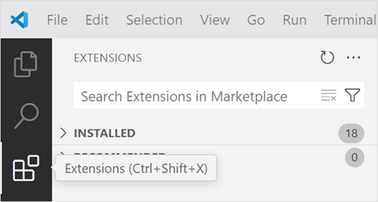

3. 搜索插件仓颉，在搜索栏输入关键词**Cangjie**，找到**Cangjie**插件后，点击 Install 按钮安装。

    

4. 已经安装的插件可以在 INSTALLED 目录下查看。

    

## 安装仓颉 SDK

仓颉 SDK 主要提供了仓颉语言编译命令（cjc）、仓颉语言官方包管理工具（Cangjie Package Manager，简称 CJPM），以及仓颉格式化工具（Cangjie Formatter，简称 cjfmt）等命令行工具。正确安装并配置仓颉 SDK 后，可使用工程管理、编译构建、格式化、静态检查和覆盖率统计等功能。开发者可以通过以下两种方式下载 SDK：

- 离线手动安装。在官网下载 SDK 安装包，并在本地安装部署仓颉 SDK。
- 通过 VSCode 安装。仓颉插件提供了仓颉 SDK 最新版本的下载和更新功能，开发者可以在 VSCode 完成最新版本仓颉 SDK 的下载和本地环境部署。

### 下载 SDK

开发者可以自行前往[仓颉下载中心](https://cangjie-lang.cn/download)，手动下载仓颉 SDK。

#### Windows 平台

Windows 平台的 SDK 下载内容为：`cangjie-sdk-windows-x64-x.y.z.exe` 或 `cangjie-sdk-windows-x64-x.y.z.zip`。

下载 SDK 并放置在本地。若下载 .exe 文件，运行该文件，根据提示选择安装路径并记录该路径。若下载 .zip 文件，解压该文件，记录存储的路径。

SDK 文件夹的目录结构如下：

```text
cangjie

├── bin

├── lib

├── modules

├── runtime

├── third_party

├── tools

├── envsetup.bat

├── envsetup.ps1

└── envsetup.sh
```

#### Linux 平台

Linux_x64 平台的 SDK 下载内容为：`cangjie-sdk-linux-x64-x.y.z.tar.gz`。

Linux_AArch64 平台的 SDK 下载内容为：`cangjie-sdk-linux-aarch64-x.y.z.tar.gz`。

下载 SDK 并放置在本地，记录存储的路径。目录结构如下：

```text
cangjie

├── bin

├── include

├── lib

├── modules

├── runtime

├── third_party

├── tools

└── envsetup.sh
```

#### macOS 平台

macOS_AArch64 平台的 SDK 下载内容为：`cangjie-sdk-mac-aarch64-x.y.z.tar.gz`。

下载 SDK 并放置在本地，记录存储的路径。目录结构如下：

```text
cangjie

├── bin

├── lib

├── modules

├── runtime

├── third_party

├── tools

└── envsetup.sh
```

### SDK 路径配置

安装完仓颉插件后，即可配置 SDK 的路径。单击左下角齿轮图标，选择设置选项。

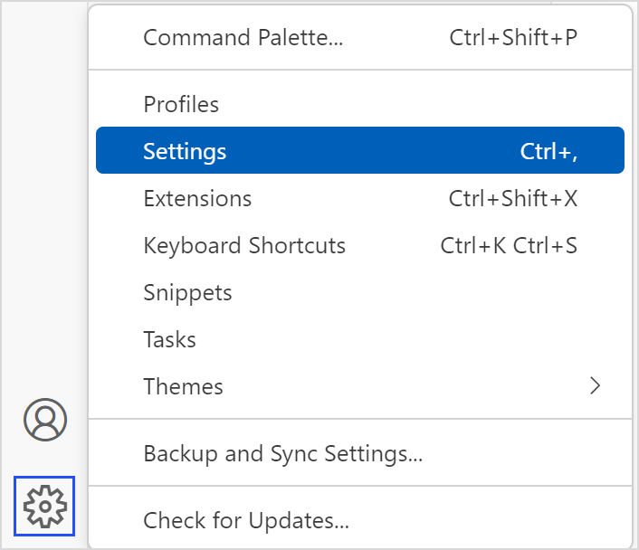

或直接右键单击插件，选择 Extension Settings，进入配置页面。


在搜索栏输入 Cangjie，选择侧边栏的 Cangjie Language Support 选项。

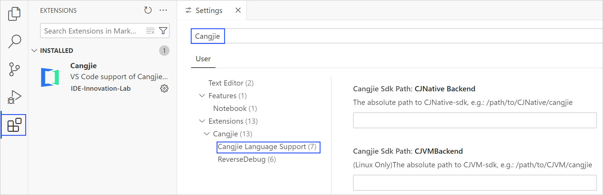

**配置 CJNative 后端**

1. 找到 Cangjie Sdk: Option 选项，选择后端类型为 CJNative（默认是此选项）。

2. 找到 Cangjie Sdk Path: CJNative Backend 选项，输入 CJNative 后端 SDK 文件夹所在绝对路径。

3. 重启 VSCode 生效。


### 工程根目录配置

插件默认以当前打开的工作区根目录作为仓颉工程根目录，并在根目录下查找 `cjpm.toml` 来识别仓颉工程。若 `cjpm.toml` 不在工作区根目录（例如工作区中包含多个子工程，仓颉工程位于某个子目录），需要手动指定 `cjpm.toml` 的路径，否则语言服务、格式化、静态检查、覆盖率统计等功能将无法正常使用。

插件提供两种指定方式：

**方式一：通过命令面板指定**

1. 按 `Ctrl+Shift+P`（macOS 为 `Command+Shift+P`）打开命令面板。

2. 输入并选择 `Cangjie: Custom Project Root Cjpm Toml` 命令。

3. 在弹出的文件选择对话框中，选中目标 `cjpm.toml` 文件，插件随即以该文件所在目录为工程根目录重启语言服务。

    

**方式二：通过设置项指定**

1. 按照 [SDK 路径配置](#sdk-路径配置) 中的步骤进入插件配置页面。

2. 找到 **Cangjie › Root: Cjpm Path** 配置项，填写 `cjpm.toml` 文件的绝对路径。

   路径示例：
    - Windows：`C:\projects\my_app\subproject\cjpm.toml`
    - Linux / macOS：`/home/user/projects/my_app/subproject/cjpm.toml`

   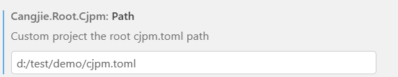

### 安装验证

通过快捷键 Ctrl + Shift + P（macOS 系统的快捷键为 Command + Shift + P） 调出 VSCode 的命令面板，选择 cangjie: Create Cangjie Project View 命令。


弹出创建仓颉项目页面，说明仓颉 SDK 安装成功。

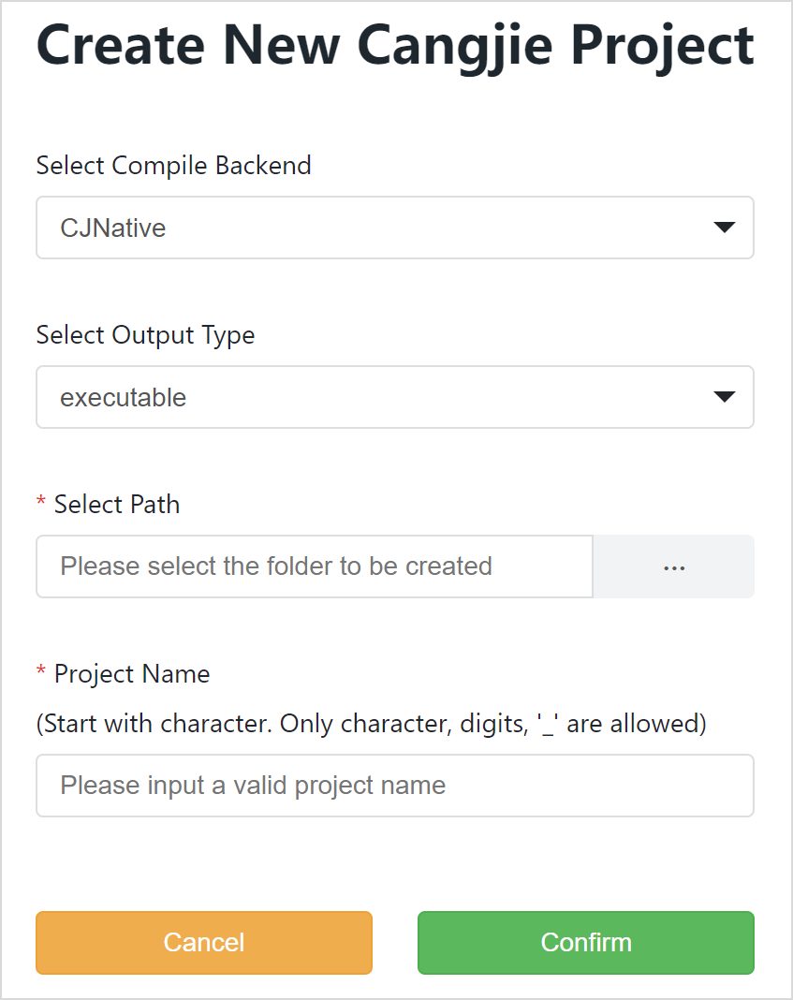

### 注意事项

- Windows 平台不支持源码文件名及路径包含中文字符的场景。
- 源码文件名及路径建议遵循仓颉编程规范命名，不建议包含除 [0-9a-zA-Z_] 之外的字符，特殊字符会被替换成 `=`。

### 配置多个仓颉 SDK

仓颉插件支持配置多个 SDK 。

#### 进入 SDK 配置界面

通过以下2种方式可以进入 SDK 配置界面。

方式一：使用 VSCode 命令面板

在 VSCode 中使用快捷键 F1，或同时按下 Ctrl + Shift + P（macOS 系统为 Command + Shift + P）打开命令面板，选择配置仓颉 SDK 命令。


进入 SDK 配置界面。

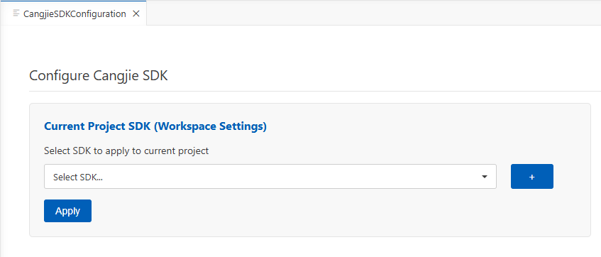

方式二：通过设置中的链接

单击左下角齿轮图标，选择设置选项。


或直接右键单击插件，选择 Extension Settings，进入配置页面。


在搜索栏输入 Cangjie，选择侧边栏的 Cangjie Language Support 选项，点击**SDK Configuration**跳转到 SDK 配置界面。

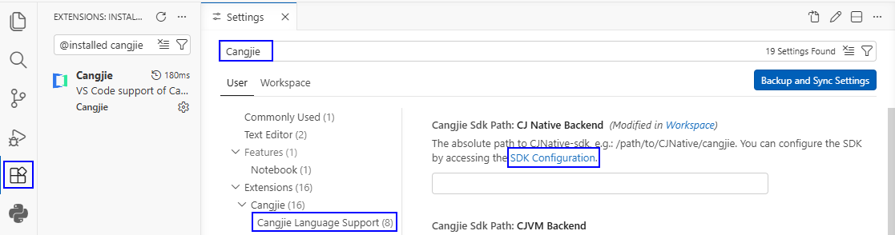

进入 SDK 配置界面。


#### 添加本地仓颉 SDK

点击界面上 + 按钮。


弹出界面选择仓颉 SDK 文件夹。

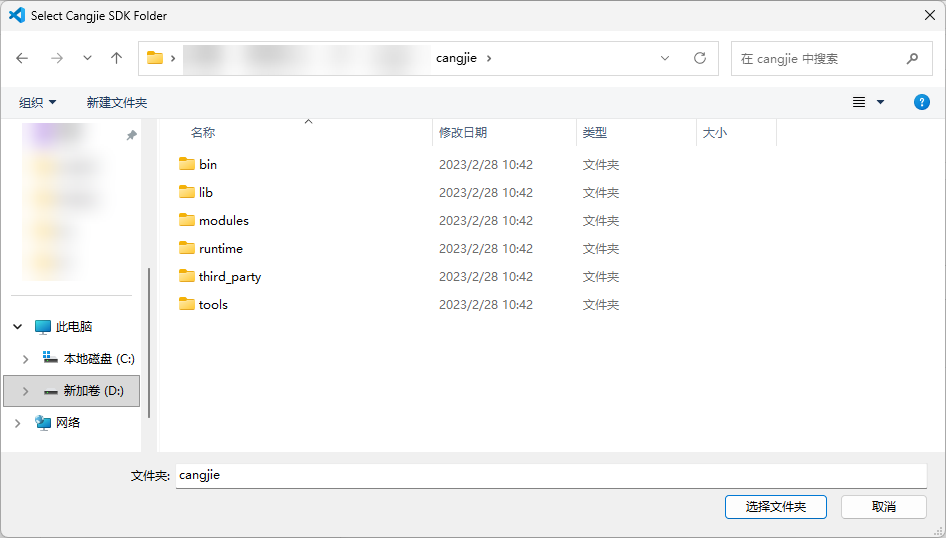

SDK 会添加到下拉框列表，会默认识别 SDK 的版本与后端类型。

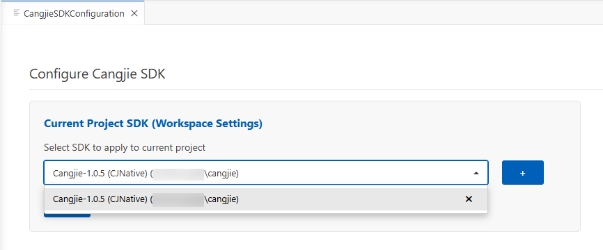

从下拉列表选择当前工程要使用的 SDK ，点击 Apply 按钮。

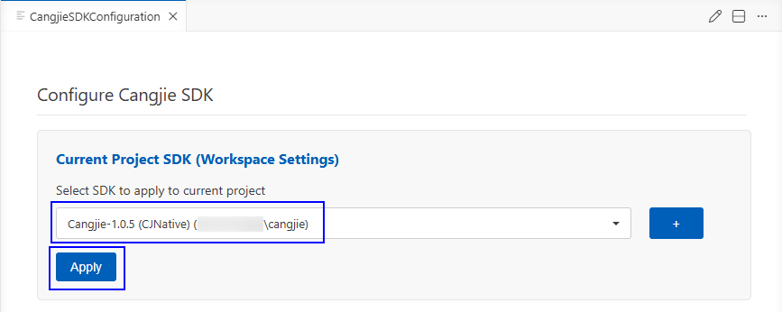

SDK 路径自动同步到设置中 Workspace 级别的 SDK 路径配置项里。

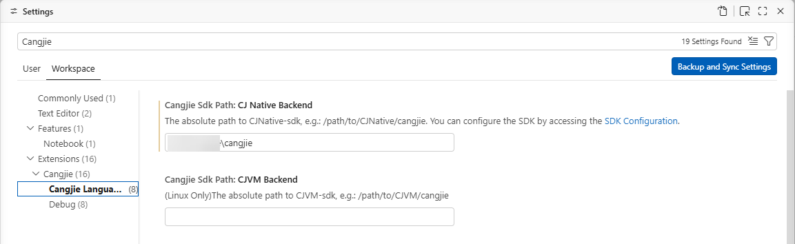

#### 删除下拉框列表的 SDK

单击下拉框，点击要删除的 SDK 项的 x 按钮。

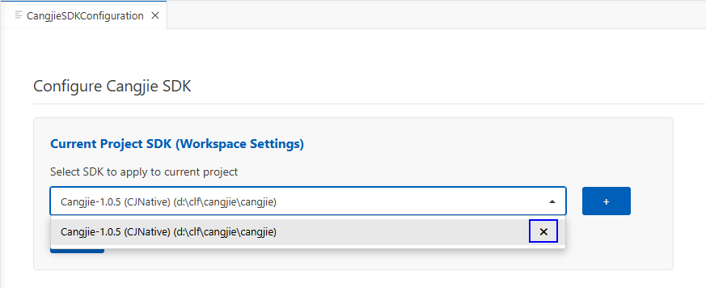

在弹出的确认界面单击 Delete 按钮确认删除。

